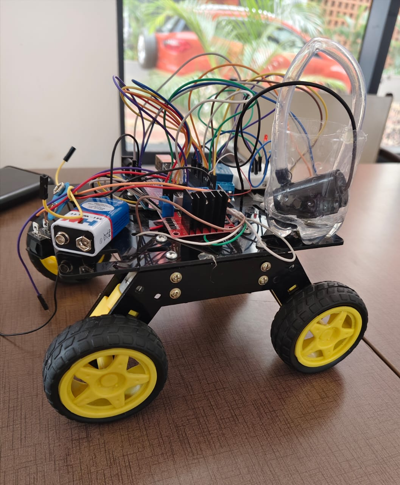

#  Selective Automated Pesticide Sprayer

An **Edge-AI based smart agriculture system** that detects crops using computer vision and sprays pesticides only when necessary. The system integrates **embedded hardware, machine learning, and automation** to enable precision agriculture and reduce excessive pesticide usage.

---

##  Hardware Prototype

Prototype of the selective pesticide spraying robot built using embedded electronics, motor drivers, and a spray mechanism mounted on a mobile platform.

---

##  Features

-  Real-time crop detection using camera module
-  Edge AI inference on embedded hardware
-  Automated selective pesticide spraying
-  Hardware–software integration using Arduino
-  Mobile robotic platform for field navigation
-  Reduces pesticide usage and environmental impact
-  Lightweight and efficient embedded system

---

##  System Architecture

The system works through the following pipeline:

1. Camera captures real-time images of crops
2. Images are processed using a machine learning model
3. The system detects crops or target regions
4. A signal is sent to the microcontroller
5. The relay activates the spray pump
6. Pesticide is sprayed only where detection occurs

This enables **precision agriculture**, reducing unnecessary chemical spraying across the field.

---

##  Tech Stack

### Hardware

- ESP32-CAM / Microcontroller
- Motor Driver Module
- Relay Module
- Water Pump
- Spray Nozzle
- Robot Chassis with Wheels
- Battery Power Supply

### Software

- C / Arduino
- Embedded Machine Learning
- Arduino IDE

### Tools

- Git
- Embedded Systems Programming
- Computer Vision Pipeline

---

##  Results

- Crop detection accuracy: **~91%**
- Pesticide usage reduced by **35–40%**
- Real-time operation on **embedded hardware**

---

##  Applications

- Precision agriculture
- Smart farming automation
- Crop monitoring systems
- Sustainable pesticide management

---

##  Future Improvements

- GPS-based autonomous navigation
- Mobile app monitoring
- Cloud-based crop analytics
- Multi-crop detection models
- IoT-based remote control

---

##  Author

**Sahithi Dudipala**  
Dual Degree (B.Tech + M.Tech) in Computer Science  
IIITDM Kurnool  

GitHub: https://github.com/myriad-8
